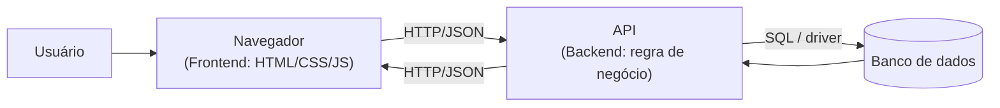
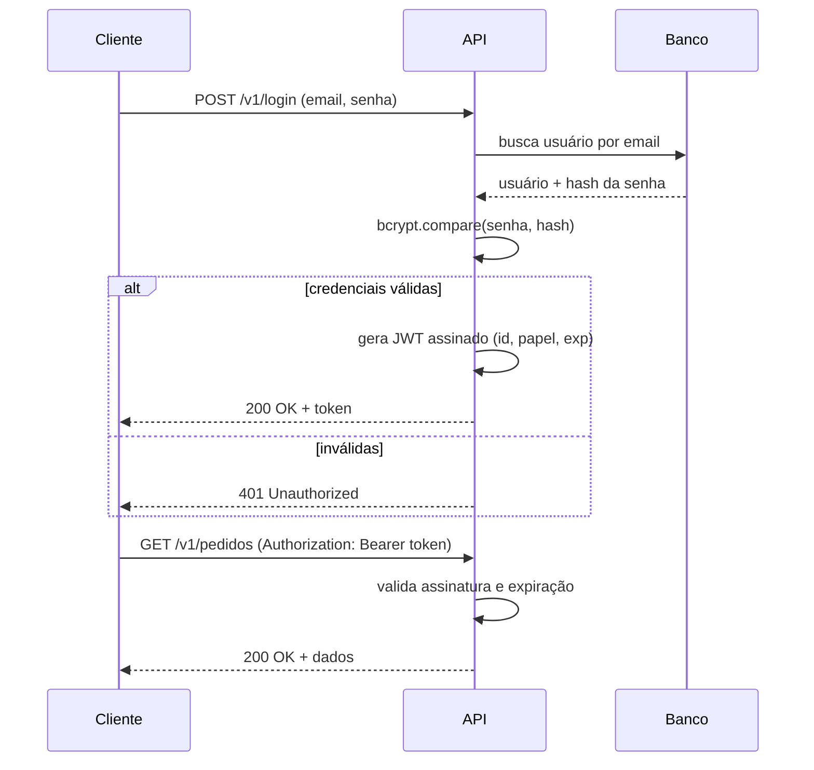
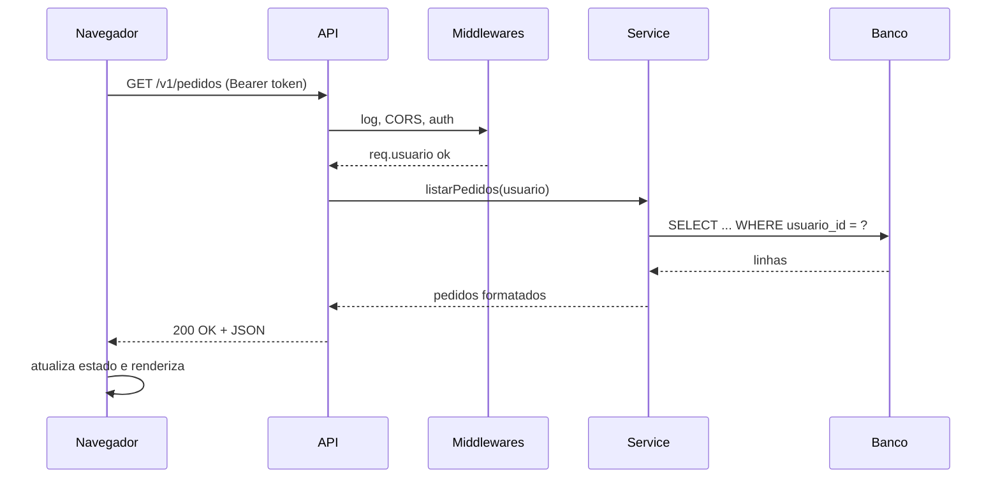

# Miniguia de Estudos — Conceitos de Desenvolvimento Full Stack

Material de revisão, em português, dos conceitos que aparecem no dia a dia de quem
constrói uma aplicação web completa — da rede ao deploy. Cada tópico tem uma
explicação curta e pelo menos um exemplo (código ou diagrama).

**Para quem é:** quem já programa um pouco e quer amarrar as pontas entre frontend,
backend e banco de dados.
**O que não é:** um curso passo a passo nem referência de API. É um mapa para revisar
rápido e saber o que estudar a seguir.
**Ordem sugerida:** leia da seção 1 à 4 em ordem; depois pule para o que precisar.

## Sumário

1. [Panorama: o que é full stack](#1-panorama-o-que-é-full-stack)
2. [Como a web funciona](#2-como-a-web-funciona)
3. [HTTP na prática](#3-http-na-prática)
4. [Frontend](#4-frontend)
5. [Backend](#5-backend)
6. [APIs REST](#6-apis-rest)
7. [Banco de dados](#7-banco-de-dados)
8. [Autenticação e autorização](#8-autenticação-e-autorização)
9. [Fluxo completo de uma requisição](#9-fluxo-completo-de-uma-requisição)
10. [Boas práticas transversais](#10-boas-práticas-transversais)
11. [Glossário](#11-glossário)
12. [Trilha de estudos e próximos passos](#12-trilha-de-estudos-e-próximos-passos)
13. [Referências abertas](#13-referências-abertas)

---

## 1. Panorama: o que é full stack

"Full stack" é ser capaz de trabalhar nas duas pontas de uma aplicação web e na
camada de dados que fica entre elas. Não significa dominar tudo com profundidade,
e sim entender como as partes se conectam e conseguir navegar por todas quando
necessário. Na prática, uma aplicação típica se divide em três camadas com
responsabilidades bem distintas.

- **Frontend (cliente):** roda no navegador. Cuida da interface, da interação e de
  exibir os dados. Tecnologias-base: HTML, CSS e JavaScript.
- **Backend (servidor):** roda em um servidor. Contém a regra de negócio, expõe uma
  API, valida entradas, cuida de autenticação e conversa com o banco.
- **Camada de dados:** onde os dados ficam guardados de forma persistente — bancos
  relacionais (PostgreSQL, MySQL) ou NoSQL (MongoDB, Redis).



O contrato entre frontend e backend quase sempre é uma **API HTTP que troca JSON**.
Trocar o framework de qualquer lado não muda essa ideia central.

---

## 2. Como a web funciona

Antes de qualquer framework, existe o modelo **cliente-servidor**: o cliente (navegador)
faz uma **requisição** e o servidor devolve uma **resposta**. Para que isso aconteça,
alguns passos de rede ocorrem quase sempre sem você perceber.

- **DNS:** traduz um domínio (`api.exemplo.com`) para um endereço IP.
- **TCP:** abre uma conexão confiável com o servidor naquele IP e porta.
- **TLS:** negocia criptografia quando a URL usa **HTTPS** (hoje, o padrão). Garante
  que ninguém no caminho leia ou altere o tráfego.
- **HTTP:** o protocolo de aplicação em que a requisição e a resposta são escritas.

**HTTP vs HTTPS:** é o mesmo protocolo; o "S" é o TLS por baixo. Use HTTPS sempre —
cookies de sessão e tokens trafegando em HTTP puro podem ser interceptados.

Cada requisição HTTP é **independente** (o protocolo é *stateless*). Qualquer noção
de "usuário logado" entre requisições é recriada por cookies ou tokens (seção 8).

---

## 3. HTTP na prática

Uma mensagem HTTP tem **linha inicial**, **headers** (metadados) e um **corpo**
opcional. O cliente escolhe um **método** que descreve a intenção, e o servidor
responde com um **status code** que resume o resultado.

**Métodos mais usados:**

| Método | Intenção | Tem corpo? | Idempotente? |
|--------|----------|------------|--------------|
| `GET` | Ler um recurso | Não | Sim |
| `POST` | Criar um recurso / disparar ação | Sim | Não |
| `PUT` | Substituir um recurso inteiro | Sim | Sim |
| `PATCH` | Atualizar parte de um recurso | Sim | Não necessariamente |
| `DELETE` | Remover um recurso | Não | Sim |

*Idempotente* = repetir a mesma chamada leva ao mesmo estado final.

**Faixas de status code:**

- `2xx` — sucesso (`200 OK`, `201 Created`, `204 No Content`).
- `3xx` — redirecionamento (`301`, `304 Not Modified`).
- `4xx` — erro do cliente (`400 Bad Request`, `401 Unauthorized`,
  `403 Forbidden`, `404 Not Found`, `409 Conflict`, `422 Unprocessable Entity`).
- `5xx` — erro do servidor (`500 Internal Server Error`, `502`, `503`).

**Headers comuns:** `Content-Type` (formato do corpo), `Authorization` (credencial),
`Accept` (formato que o cliente quer), `Cache-Control`, `Set-Cookie`.

Exemplo de um par requisição/resposta cru:

```http
POST /v1/login HTTP/1.1
Host: api.exemplo.com
Content-Type: application/json

{ "email": "ana@exemplo.com", "senha": "s3nh4-secreta" }
```

```http
HTTP/1.1 200 OK
Content-Type: application/json

{ "token": "eyJhbGciOiJIUzI1NiJ9...", "expiraEm": 3600 }
```

---

## 4. Frontend

O frontend transforma dados em interface e captura as ações do usuário. Os três
pilares têm papéis separados:

- **HTML** — estrutura e semântica do conteúdo.
- **CSS** — apresentação: layout, cores, tipografia, responsividade.
- **JavaScript** — comportamento: reage a eventos, atualiza a tela, chama a API.

**DOM e eventos:** o navegador representa a página como uma árvore de objetos (o DOM).
O JS escuta eventos nessa árvore e reage a eles.

```js
const form = document.querySelector("#login");

form.addEventListener("submit", async (evento) => {
  evento.preventDefault();
  const dados = Object.fromEntries(new FormData(form));

  const resp = await fetch("/v1/login", {
    method: "POST",
    headers: { "Content-Type": "application/json" },
    body: JSON.stringify(dados),
  });

  if (!resp.ok) return mostrarErro(resp.status);
  const { token } = await resp.json();
  localStorage.setItem("token", token);
  location.assign("/painel");
});
```

**SPA vs SSR:**

- **SPA (Single Page Application):** o servidor manda um HTML mínimo e o JS monta as
  telas no navegador, buscando dados via API. Navegação fluida; primeira carga e SEO
  exigem cuidado.
- **SSR (Server-Side Rendering):** o servidor devolve o HTML já renderizado. Melhor
  primeira carga e SEO; mais trabalho no servidor. Frameworks modernos (Next.js,
  Nuxt, SvelteKit) misturam os dois.

**Frameworks e build:** React, Vue, Angular e Svelte organizam a UI em componentes
com estado. Um *bundler/build tool* (Vite, esbuild, webpack) junta e otimiza os
arquivos para produção (minificação, *tree-shaking*, *code splitting*).

---

## 5. Backend

O backend é onde ficam as decisões que não podem ser confiadas ao cliente: regra de
negócio, validação "de verdade", permissões, integrações e acesso ao banco. Ele
expõe **endpoints** que o frontend consome.

```js
import express from "express";
const app = express();
app.use(express.json());

// GET /v1/usuarios/42
app.get("/v1/usuarios/:id", async (req, res) => {
  const usuario = await repositorioUsuarios.buscarPorId(req.params.id);
  if (!usuario) return res.status(404).json({ erro: "não encontrado" });
  res.json(usuario);
});

app.listen(3000);
```

**Middleware:** função que roda *antes* do handler final, na cadeia da requisição.
Bom para logging, parsing, CORS, autenticação e tratamento de erro.

```js
function exigirAutenticacao(req, res, next) {
  const header = req.headers.authorization ?? "";
  const token = header.replace("Bearer ", "");
  try {
    req.usuario = verificarToken(token); // lança se inválido
    next();
  } catch {
    res.status(401).json({ erro: "token inválido" });
  }
}

app.get("/v1/pedidos", exigirAutenticacao, listarPedidos);
```

**Organização em camadas** (mantém o código testável e sem lógica na rota):

- **Controller / rota** — lê a requisição, chama o serviço, monta a resposta HTTP.
- **Service** — regra de negócio, orquestra passos, não sabe o que é HTTP.
- **Repository** — acesso a dados; esconde SQL/ORM do resto do código.

---

## 6. APIs REST

REST é um estilo de API em que tudo gira em torno de **recursos** identificados por
URL. A URL é um **substantivo**; o **verbo** é o método HTTP. Isso deixa a API
previsível.

```
GET    /v1/usuarios            # lista
POST   /v1/usuarios            # cria
GET    /v1/usuarios/42         # detalha
PATCH  /v1/usuarios/42         # atualiza parte
DELETE /v1/usuarios/42         # remove
GET    /v1/usuarios/42/pedidos # recurso aninhado
```

Boas práticas:

- **Versionar** a API no caminho (`/v1/...`) para poder evoluir sem quebrar clientes.
- **Paginar** listas grandes (`?page=2&limit=20` ou cursores).
- Usar **status codes** corretos em vez de sempre `200` com um campo `erro`.
- Manter `GET` **sem efeitos colaterais**.
- Respostas e erros em **formato consistente** (mesmo shape de erro em toda a API).

**Alternativa — GraphQL:** um único endpoint em que o cliente descreve exatamente os
campos que quer, evitando *over/under-fetching*. Custa mais complexidade no servidor
(schema, resolvers, cache). REST continua sendo o padrão para a maioria dos casos.

---

## 7. Banco de dados

**Relacional (SQL)** — dados em tabelas com colunas tipadas e relações entre elas.
Forte em consistência, consultas complexas (`JOIN`) e transações. Ex.: PostgreSQL,
MySQL. É a escolha padrão para dados estruturados e com relações.

**NoSQL** — modelos não tabulares: documento (MongoDB), chave-valor (Redis), coluna
larga (Cassandra), grafo (Neo4j). Bom para esquema flexível, cache, escala horizontal
e dados sem muitas relações.

SQL básico com relação entre tabelas:

```sql
SELECT u.nome, COUNT(p.id) AS total_pedidos
FROM usuarios u
LEFT JOIN pedidos p ON p.usuario_id = u.id
WHERE u.criado_em >= '2026-01-01'
GROUP BY u.nome
ORDER BY total_pedidos DESC
LIMIT 10;
```

**Conceitos essenciais:**

- **Chave primária (PK):** identifica cada linha de forma única.
- **Chave estrangeira (FK):** aponta para a PK de outra tabela; garante integridade.
- **Índice:** estrutura que acelera buscas por certas colunas — ao custo de escrita
  e espaço um pouco maiores. Filtro/ordenação frequente sem índice é gargalo comum.
- **Normalização:** organizar as tabelas para evitar dados repetidos e anomalias de
  atualização; às vezes se *desnormaliza* de propósito para ganhar leitura.

**ORM** — mapeia tabelas para objetos do código, gera SQL e cuida de migrações.
Produtivo; exige atenção ao problema **N+1** (uma consulta vira centenas em loop).

```js
// Prisma
const usuario = await prisma.usuario.findUnique({
  where: { id: 42 },
  include: { pedidos: true }, // traz os pedidos numa consulta só
});
```

**Transação (ACID):** um grupo de operações que acontece por inteiro ou não acontece
(ex.: debitar de uma conta e creditar em outra). Use quando várias escritas precisam
ser consistentes entre si.

---

## 8. Autenticação e autorização

- **Autenticação:** provar *quem* é o usuário (login).
- **Autorização:** decidir *o que* esse usuário pode fazer (papéis, permissões).

**Senhas nunca são guardadas em texto puro.** Armazene um *hash* lento e com *salt*
(bcrypt, argon2):

```js
import bcrypt from "bcrypt";

const hash = await bcrypt.hash(senhaRecebida, 12);    // no cadastro
const ok   = await bcrypt.compare(senhaRecebida, hash); // no login
```

**Sessão + cookie vs JWT:**

| Aspecto | Sessão + cookie | JWT (token) |
|---------|-----------------|-------------|
| Onde fica o estado | No servidor (store/DB) | No próprio token, no cliente |
| Escala horizontal | Precisa de store compartilhado | *Stateless*, mais simples |
| Logout / revogação | Fácil (apaga a sessão) | Difícil antes de expirar |
| Transporte típico | Cookie `HttpOnly` `Secure` | Header `Authorization: Bearer` |
| Risco principal | CSRF (mitigável) | Vazamento do token; expiração longa |

Fluxo de login com token:



**OAuth 2.0 / OpenID Connect:** protocolos para "entrar com Google/GitHub" e para
autorizar terceiros a agir em nome do usuário sem compartilhar a senha. Você recebe
um token de acesso emitido pelo provedor.

---

## 9. Fluxo completo de uma requisição

O que acontece quando o usuário abre uma tela que lista pedidos:

1. **[navegador]** Usuário clica no link; o app dispara `GET /v1/pedidos` com o header
   `Authorization`.
2. **[rede]** DNS resolve o domínio → TCP conecta → TLS estabelece o canal seguro.
3. **[backend]** A API recebe a requisição; middlewares rodam (log, CORS, parsing).
4. **[backend]** Middleware de autenticação valida o token; anexa `req.usuario`.
5. **[backend]** Controller chama o service, que aplica regras (ex.: só pedidos do
   próprio usuário).
6. **[dados]** Repository consulta o banco; índice em `usuario_id` acelera a busca.
7. **[backend]** Service formata o resultado; controller responde `200 OK` + JSON.
8. **[frontend]** O JS recebe o JSON, atualiza o estado e o DOM renderiza a lista.
9. **[erro]** Token expirado → `401`; sem permissão → `403`; falha inesperada →
   `500` (e um log com *stack trace* no servidor).



---

## 10. Boas práticas transversais

### Git e fluxo de branches

Controle de versão distribuído. Fluxo comum: criar um *branch* por tarefa, commitar
em pequenos passos, abrir *pull request*, revisar e fazer *merge* na `main`.

```sh
git switch -c feat/lista-pedidos
git add -p && git commit -m "adiciona endpoint de listagem de pedidos"
git push -u origin feat/lista-pedidos
# abre o Pull Request e pede revisão
```

### Testes

A **pirâmide de testes**: muitos testes **unitários** (função isolada, rápidos),
menos de **integração** (módulos + banco), poucos **end-to-end** (fluxo real do
usuário, lentos e frágeis).

```js
import { describe, it, expect } from "vitest";
import { calcularTotal } from "./carrinho.js";

describe("calcularTotal", () => {
  it("soma itens e aplica desconto", () => {
    const itens = [{ preco: 100, qtd: 2 }, { preco: 50, qtd: 1 }];
    expect(calcularTotal(itens, { desconto: 0.1 })).toBe(225);
  });
});
```

### CI/CD

*Continuous Integration*: a cada push, um pipeline instala dependências, roda lint e
testes e faz o build. *Continuous Delivery/Deployment*: se tudo passa, publica em
staging/produção automaticamente. Reduz "na minha máquina funciona".

### 12-Factor e variáveis de ambiente

Configuração (URLs, segredos, credenciais) fica em **variáveis de ambiente**, não no
código. Dependências são declaradas, *build* e *run* são etapas separadas, logs são
um fluxo para stdout, e o ambiente de dev deve parecer o de produção.

### Logs e observabilidade

Além de `console.log`: **logs estruturados** (JSON com nível e contexto), **métricas**
(latência, taxa de erro, throughput) e **tracing** (seguir uma requisição por vários
serviços). É o que permite descobrir *por que* algo quebrou em produção.

### Segurança (OWASP, o essencial)

- **Injeção (SQL, comandos):** nunca concatene entrada do usuário em query; use
  *prepared statements* / consultas parametrizadas.
- **XSS:** escape/sanitize o que for renderizado no HTML; use `Content-Security-Policy`.
- **CSRF:** proteja rotas que mudam estado quando usa cookie de sessão (token CSRF,
  `SameSite`).
- **Autenticação/sessão quebrada:** hashing forte de senha, expiração de token,
  *rate limiting* no login.
- **Exposição de dados:** valide e filtre a saída; não vaze *stack trace* para o cliente.
- Mantenha dependências atualizadas (`npm audit`, Dependabot).

### Cache e performance

Guardar resultados caros para reusar: no navegador (`Cache-Control`), numa CDN, ou no
servidor (Redis). O difícil é **invalidar** quando o dado muda. Meça antes de otimizar.

### Docker e containers

Um *container* empacota app + dependências + configuração numa imagem que roda igual
em qualquer lugar. Facilita paridade dev/prod e deploy. Orquestração (Kubernetes)
entra quando há muitos containers para coordenar.

---

## 11. Glossário

| Termo | Definição curta |
|-------|-----------------|
| **API** | Interface pela qual um sistema pede dados/ações a outro. |
| **REST** | Estilo de API baseado em recursos manipulados por métodos HTTP. |
| **Endpoint** | Uma rota específica da API (ex.: `GET /v1/usuarios/42`). |
| **HTTP** | Protocolo de requisição/resposta da web. |
| **HTTPS** | HTTP sobre TLS (tráfego criptografado). |
| **Método HTTP** | Verbo da requisição: `GET`, `POST`, `PUT`, `PATCH`, `DELETE`. |
| **Status code** | Código numérico do resultado (`200`, `404`, `500`...). |
| **Header** | Metadado da requisição/resposta (`Content-Type`, `Authorization`). |
| **JSON** | Formato de texto para troca de dados entre sistemas. |
| **Idempotência** | Repetir a chamada não muda o resultado final. |
| **CRUD** | Create, Read, Update, Delete. |
| **DOM** | Representação em árvore da página, manipulável por JS. |
| **SPA / SSR** | UI montada no cliente / HTML renderizado no servidor. |
| **Bundler** | Ferramenta que junta e otimiza os arquivos do front (Vite, webpack). |
| **Frontend / Backend** | Parte que roda no navegador / no servidor. |
| **Full stack** | Atuar em front, back e camada de dados. |
| **Middleware** | Função que intercepta a requisição antes do handler. |
| **Controller / Service / Repository** | Camadas: HTTP / regra de negócio / acesso a dados. |
| **SQL / NoSQL** | Banco em tabelas relacionais / modelos não tabulares. |
| **PK / FK** | Chave primária (identifica a linha) / estrangeira (referencia outra tabela). |
| **Índice** | Estrutura que acelera buscas em colunas específicas. |
| **Transação (ACID)** | Grupo de operações que ocorre por inteiro ou é desfeito. |
| **ORM** | Biblioteca que mapeia tabelas para objetos e gera SQL. |
| **N+1** | Antipadrão: uma consulta que vira muitas dentro de um loop. |
| **Autenticação / Autorização** | Quem é o usuário / o que ele pode fazer. |
| **Sessão** | Estado de login guardado no servidor, referenciado por cookie. |
| **JWT** | Token assinado e autocontido para autenticação *stateless*. |
| **Claim** | Cada informação carregada dentro de um JWT. |
| **Hash / Salt** | Resumo irreversível da senha / valor aleatório que o torna único. |
| **OAuth / OIDC** | Protocolos de login delegado ("entrar com Google"). |
| **CORS** | Regras do navegador para chamadas entre origens diferentes. |
| **CSRF / XSS** | Ataques: forjar requisição autenticada / injetar script na página. |
| **CI/CD** | Automação de testes/build (CI) e de entrega (CD). |
| **Branch / Merge** | Linha de trabalho paralela / sua junção ao código principal. |
| **Variável de ambiente** | Configuração externa ao código, lida em runtime. |
| **Cache** | Cópia temporária de dados caros para acelerar respostas. |
| **Container** | App + dependências empacotados para rodar igual em qualquer lugar. |
| **Deploy** | Publicar a aplicação em um ambiente acessível. |

---

## 12. Trilha de estudos e próximos passos

**Fase 1 — Fundamentos**
- [ ] HTML semântico e CSS (box model, flexbox, grid, responsividade)
- [ ] JavaScript moderno (ES6+, assíncrono: Promises, `async/await`)
- [ ] Git: branch, merge, rebase, pull request
- [ ] Como a web funciona: DNS, HTTP, status codes, headers

**Fase 2 — Frontend**
- [ ] Um framework de componentes (React ou Vue) e seu modelo de estado
- [ ] Consumo de API com `fetch`, tratamento de erro e loading
- [ ] Build com Vite; noções de SPA vs SSR

**Fase 3 — Backend**
- [ ] Um framework HTTP (Express, Fastify, NestJS, Django, Spring...)
- [ ] Modelagem de rotas REST, validação de entrada, middleware
- [ ] Organização em camadas e testes automatizados

**Fase 4 — Dados**
- [ ] SQL: `SELECT`, `JOIN`, `GROUP BY`, índices, `EXPLAIN`
- [ ] Modelagem relacional e migrações
- [ ] Um ORM; quando usar NoSQL/Redis

**Fase 5 — Auth e deploy**
- [ ] Sessão vs JWT; hashing de senha; OAuth
- [ ] Variáveis de ambiente e configuração por ambiente
- [ ] Docker básico; um pipeline de CI; deploy em uma plataforma (Render, Fly, Vercel, AWS)

**Fase 6 — Avançado**
- [ ] Filas e mensageria (RabbitMQ, Kafka, SQS)
- [ ] WebSockets e tempo real
- [ ] Cache distribuído e estratégias de invalidação
- [ ] Observabilidade: logs estruturados, métricas, tracing
- [ ] Microsserviços, Infraestrutura como Código (Terraform), Kubernetes

---

## 13. Referências abertas

- **MDN Web Docs — HTTP:** https://developer.mozilla.org/pt-BR/docs/Web/HTTP
- **MDN — Aprender desenvolvimento web:** https://developer.mozilla.org/pt-BR/docs/Learn
- **roadmap.sh — Full Stack:** https://roadmap.sh/full-stack
- **The Twelve-Factor App:** https://12factor.net/pt_br/
- **REST API Tutorial:** https://restfulapi.net
- **JWT — Introdução:** https://jwt.io/introduction
- **Use The Index, Luke (SQL/índices):** https://use-the-index-luke.com
- **OWASP Top 10:** https://owasp.org/www-project-top-ten/
